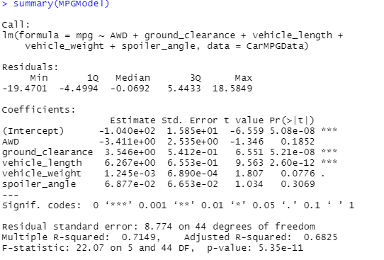
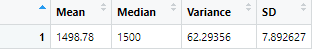
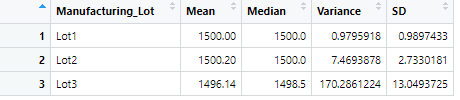
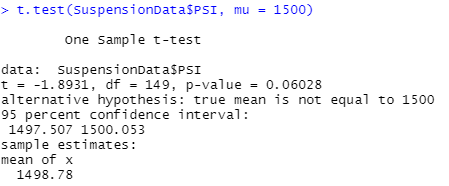

# MechaCar_Statistical_Analysis

## Linear Regression to predict MPG
According to the summary of the multiple linear regression model, the probability of all-wheel drive, vehicle weight, and spoiler angle were all likely to introduce variance into the linear model due to their Pr(>|t|) values. Due to the p-value being below the significance value of 0.05, and the coefficients for ground clearance and vehicle weight being much greater than 0, we can conclude that the slope for the linear model for those respective characteristics are not 0. With a multiple r-squared value of .71, we have a fairly probable likelyhood that the model can predict future mpgs well.

## Summary Statistics on Suspension Coils
With a variance of ~ 62 PSI, the overall variance of all coils did not exceed the limit of 100 PSI variance. Individually, lots 1 and 2 passed the same test. However, lot 3 fails this test with a variance of ~ 170 PSI.

## T-Tests on Suspension Coils
Our t-test on all lots has a p-value of ~ 0.06 (above the significance value), meaning that we cannot reject the null hypothesis that the true mean is equal 1500. Our p-test on lot 1 shows a p-value of 1. This means that there is no statistical difference between our sample and the population with a mean of 1500, and that we cannot reject the null hypothesis. The p-value of the lot 2 p-test is ~ .61, meaning that we cannot reject the null hypothesis. The p- value for the lot 3 p-test is ~ 0.042. Therefore, we can reject the null hypothesis and state that the true mean is not equal to 1500 in this case.

## Study Design: MechaCar vs Competition
The mpg of MechaCar cars will be compared to the mpg of all other cars. The null hypothesis is that there is no relationship between mpg and the manufacturer of a car being MechaCar. A one-sample t-test will be performed to determine the significance of this relationship. MPG data is needed for all known cars manufactured by MechaCar and every single other manufacturer. 
